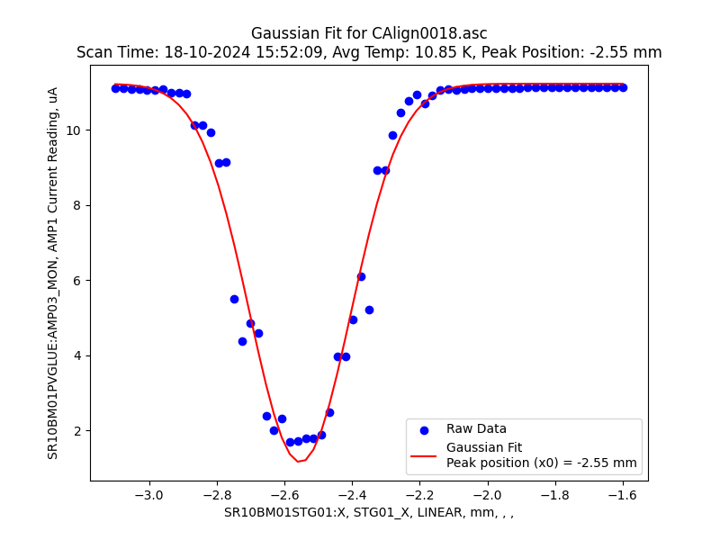
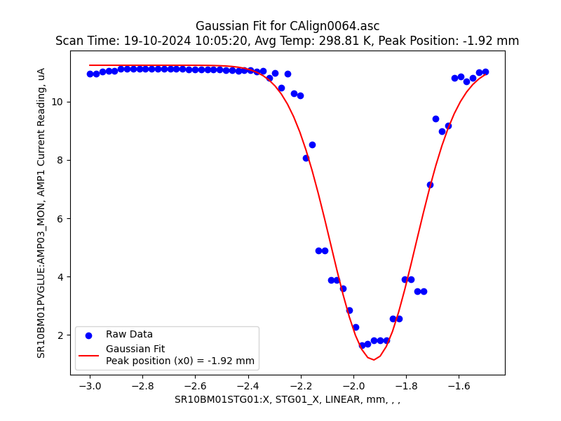
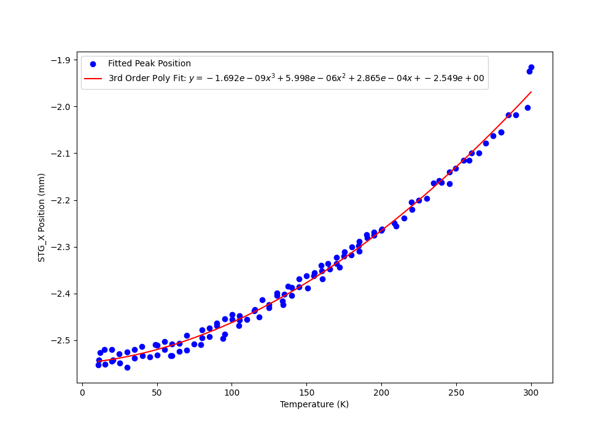
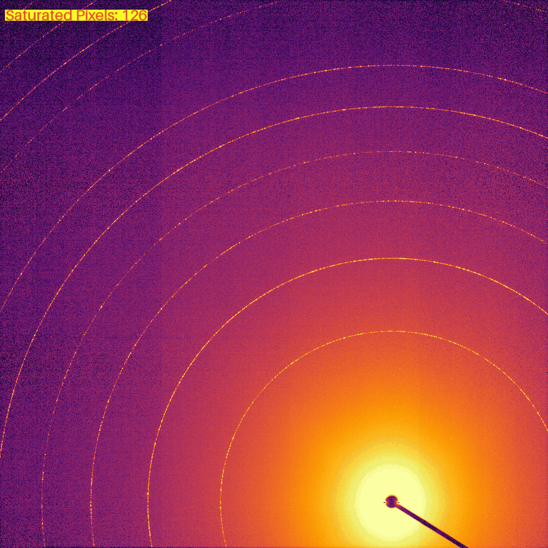
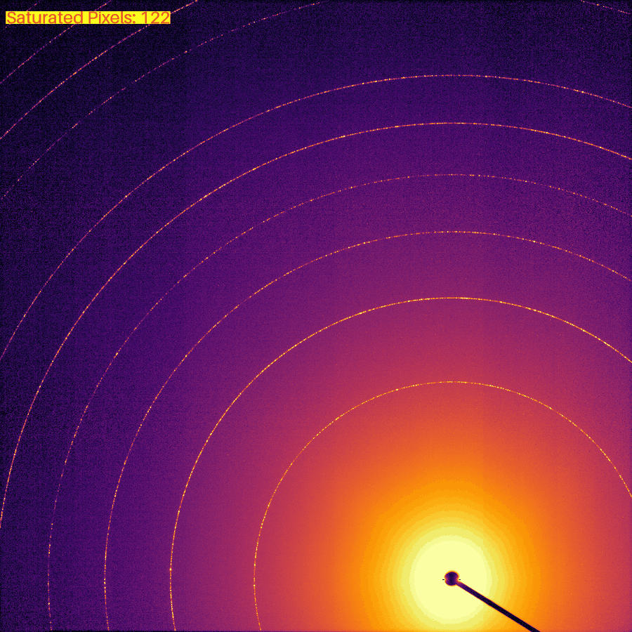
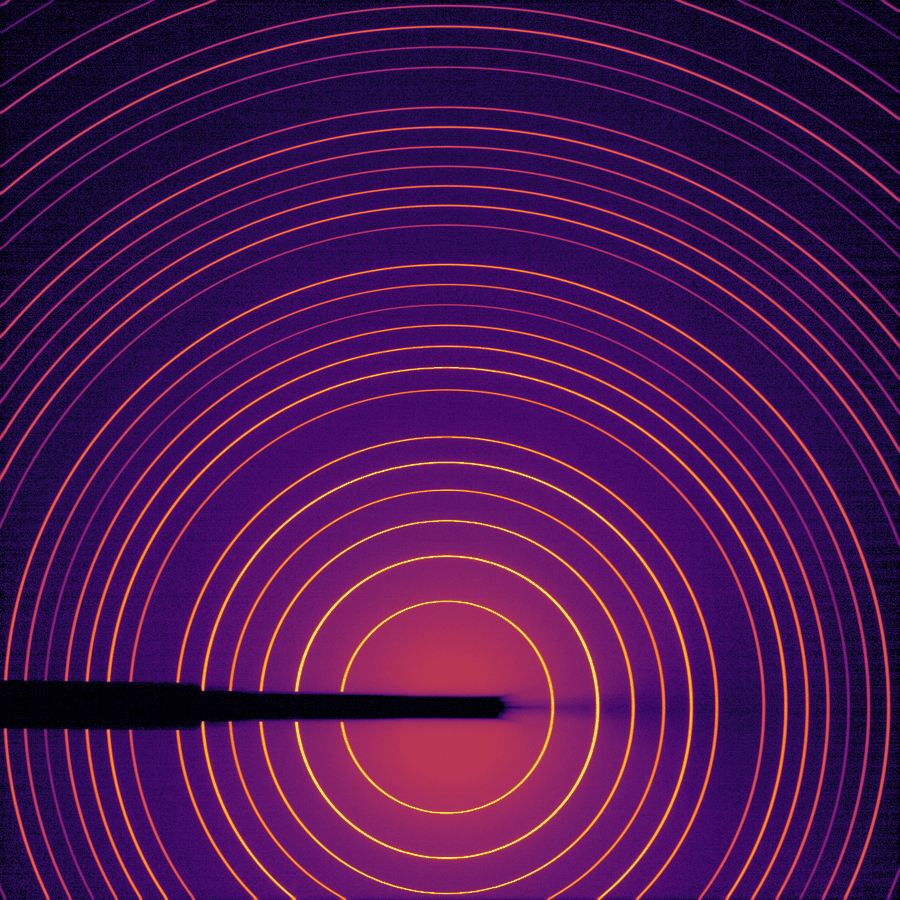
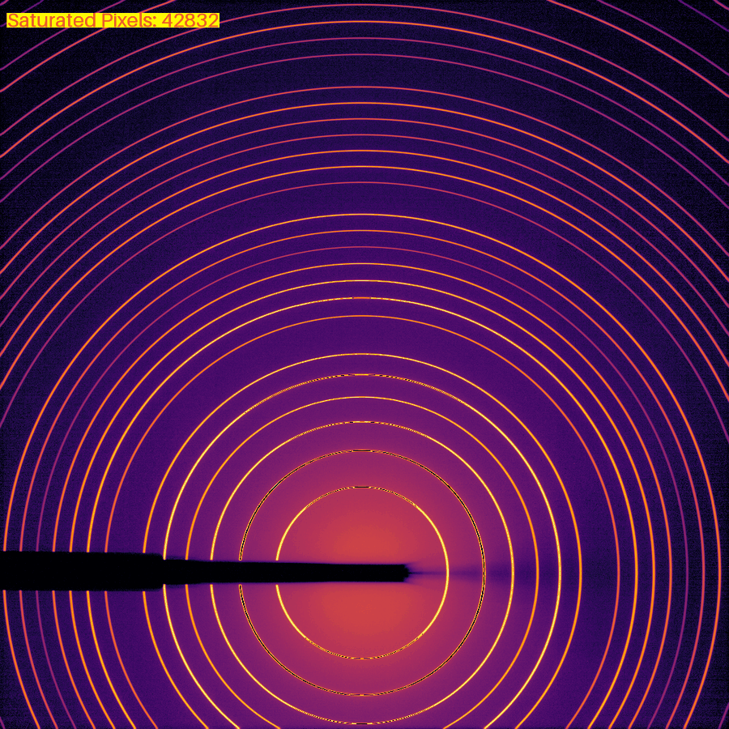
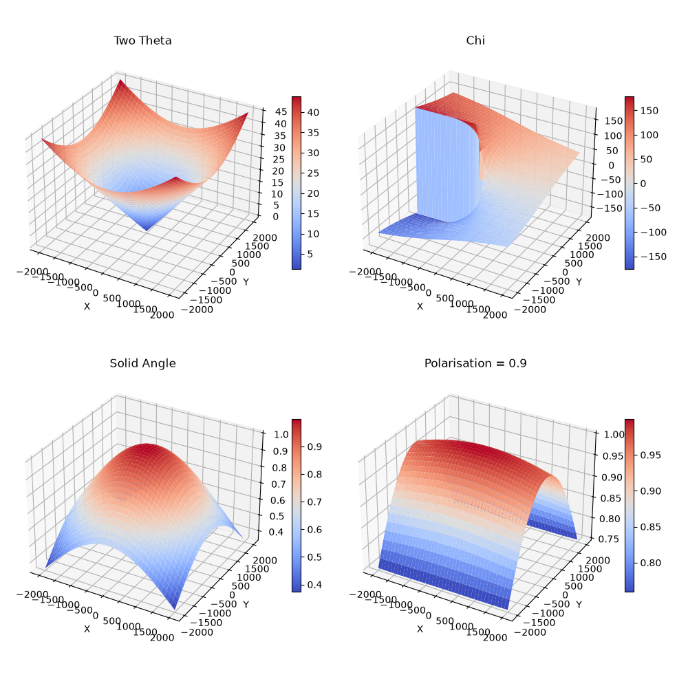

# sci-data-process

Scripts for data processing from my work as a beamline scientist
at the Powder Diffraction beamline at the Australian Synchrotron (ANSTO).

A powder diffraction beamline produces large volumes of raw data — 1D scan files,
2D area-detector images, and instrument logs — that need parsing, cleaning, fitting,
and quality-checking before they are usable. These scripts are the tooling I built for that.

This is a curated subset of a larger personal repository, kept for reference.

Some of these codes have been integrated into production codebase for the operation 
of the Powder Diffraction beamline

## What's here

| Area | What it demonstrates |
|---|---|
| **1D scan data** (`data_processing_1d/`, `cryostat_height_calibration/`) | Batch ETL over messy instrument text formats; curve fitting and regression (`scipy.optimize`, `numpy.polyfit`); consolidating many files into sorted Excel reports with `pandas` |
| **2D detector images** (`data_processing_2d/`) | `numpy` / `Pillow` image processing — stack averaging, dead-pixel masking, percentile contrast scaling, log-normalised display exports; synthetic image generation with `pyFAI` |

## Runnable vs reference

| Script | Runs without a beamline? |
|---|---|
| `data_processing_1d/`, `data_processing_2d/`, `cryostat_height_calibration/` | Yes — point them at your own `.asc` / `.tif` / `.csv` files (edit the `# Input` block at the top of each) |

## Scripts

### `data_processing_1d/`
- **`asc_metadata_extract.py`** — Walk an experiment folder recursively, parse every `.asc` scan file for metadata (scan time, detector/positioner columns, Extra PVs), handle XRpad (2D detector) multi-acquisition files, and write one time-sorted Excel table.

### `cryostat_height_calibration/`
- **`mda-gaussian_fit_pipeline.py`** — For each scan, Gaussian-fit photodiode current vs stage position to find the sample height, average the cryostat temperature, and export a height-vs-temperature summary workbook plus per-scan fit plots.
- **`polyfit_calibration.py`** — Fit a 3rd-order polynomial to sample-height calibration points and plot the curve with its equation.

#### Example: cryostat height calibration

`mda-gaussian_fit_pipeline.py` fits every photodiode-vs-stage scan (here at 10 K
and 300 K) to locate the sample height:

<p>


</p>

`polyfit_calibration.py` then fits a 3rd-order polynomial through the peak
positions from ~10–300 K, giving the height-correction curve applied during
temperature scans:




### `data_processing_2d/`
- **`image_stats_to_excel.py`** — Summarise a folder of 16-bit detector TIFFs (mean intensity, saturated-pixel counts, timestamps, gain/exposure parsed from filenames) into a multi-sheet Excel workbook.
- **`average_and_deadpixel_mask.py`** — Group repeated exposures by filename, average the stacks, and build a dead/hot-pixel mask from pixels saturated at least once.
- **`merge_deadpixel_masks.py`** — Combine several existing dead-pixel mask TIFFs into one.
- **`tif_to_png.py`** — Convert detector TIFFs to display PNGs: mask saturation, percentile-clip, downsample, log-normalise, annotate saturated-pixel counts.
- **`corrections_solid_ang_and_polar.py`** — Compute and visualise solid-angle and polarisation intensity corrections over a flat area detector as linked 3D surface / 2D image plots.
- **`simulate_calibrant_image.ipynb`** — *(exploratory)* Generate a synthetic AgBh calibrant diffraction image with `pyFAI` for testing the 2D pipeline without beamline data.

#### Example: `average_and_deadpixel_mask.py`

<p>


</p>

Left: a single exposure. Right: the mean of 10 repeated exposures of the same
sample. Averaging improves the counting statistics — the background is visibly
less noisy (√10 ≈ 3× lower noise) while the diffraction rings are unchanged.

#### Example: `tif_to_png.py`

<p>


</p>

Powder diffraction rings from an area detector (beamstop shadow lower-left),
log-normalised with the `inferno` colour map. Left: no saturation. Right: the
same detector saturated — the pixel count is stamped in red, and saturated
pixels are pushed to the low clip value (darkest end of the colour map) so they
read as broken gaps along the brightest rings rather than as false high
intensity.

#### Example: `corrections_solid_ang_and_polar.py`



Scattering angle (2θ) and azimuth (χ) across a flat area detector, and the
resulting solid-angle (cos³2θ) and polarisation corrections applied to raw
intensities. The 3D subplots share a linked view — rotating one rotates all
four; a matching set of 2D image plots is produced alongside.

## License

MIT — see [LICENSE](LICENSE).

## Setup

```bash
python -m venv .venv && source .venv/bin/activate
pip install -r requirements.txt
pip install -e .          # puts the local `scidata` helper package on the path
```

`src/scidata/` holds shared helpers (path normalisation, file filtering) used by
several scripts.
